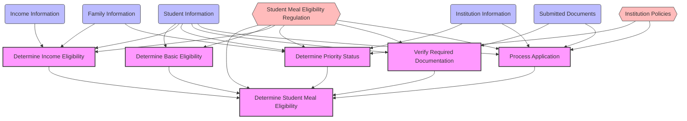
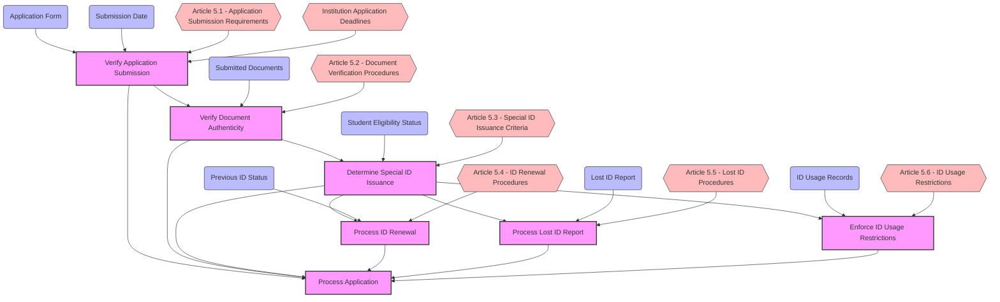
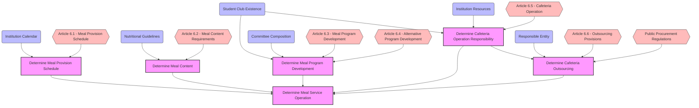

# Decision Requirements Diagrams: Student Meal Eligibility Regulation

This document presents Decision Requirements Diagrams (DRDs) for the student meal eligibility regulation, visualizing the decision-making process and its components.

## Introduction to Decision Requirements Diagrams

Decision Requirements Diagrams (DRDs) are a key component of the Decision Model and Notation (DMN) standard. They provide a formal way to represent decision logic and its dependencies. DRDs consist of the following elements:

- **Decisions** (rectangles): Represent determinations that are made in the course of business processes
- **Input Data** (ovals): Represent information used as an input by one or more decisions
- **Knowledge Sources** (document shapes): Represent sources of knowledge or authority for decisions
- **Dependencies** (arrows): Show information requirements and knowledge requirements between elements

DRDs help in understanding the structure of complex decision-making processes, identifying dependencies, and ensuring that all necessary inputs and knowledge sources are considered.

## Top-Level Decision Diagram

The following diagram shows the top-level decision "Determine Student Meal Eligibility" and its main components:

## Eligibility Determination Decision Diagram

The following diagram shows the decision structure for determining basic eligibility:

```mermaid
flowchart TD
    classDef decision fill:#f9f,stroke:#333,stroke-width:2px
    classDef inputData fill:#bbf,stroke:#333,stroke-width:1px
    classDef knowledgeSource fill:#fbb,stroke:#333,stroke-width:1px

    D1[Determine Basic Eligibility]:::decision
    D2[Check Active Student Status]:::decision
    D3[Check Previous Degree Status]:::decision
    D4[Check Visiting Student Status]:::decision
    D5[Check Transfer Student Status]:::decision
    D6[Check Foreign Scholarship Status]:::decision

    I1(Student Enrollment Status):::inputData
    I2(Student Academic History):::inputData
    I3(Student Origin Institution):::inputData
    I4(Cooperation Program Details):::inputData
    I5(Transfer Documentation):::inputData
    I6(Scholarship Documentation):::inputData

    K1{{Article 1.1 - Basic Eligibility Criteria}}:::knowledgeSource
    K2{{Article 1.2 - Visiting Student Provisions}}:::knowledgeSource
    K3{{Article 1.3 - Transfer Student Provisions}}:::knowledgeSource
    K4{{Article 1.4 - Foreign Scholarship Provisions}}:::knowledgeSource
    K5{{Institution Academic Records}}:::knowledgeSource

    D2 --> D1
    D3 --> D1
    D4 --> D1
    D5 --> D1
    D6 --> D1

    I1 --> D2
    I2 --> D3
    I3 --> D4
    I4 --> D4
    I5 --> D5
    I6 --> D6

    K1 --> D1
    K1 --> D2
    K1 --> D3
    K2 --> D4
    K3 --> D5
    K4 --> D6
    K5 --> D2
```

## Income Assessment Decision Diagram

The following diagram shows the decision structure for determining income eligibility:

```mermaid
flowchart TD
    classDef decision fill:#f9f,stroke:#333,stroke-width:2px
    classDef inputData fill:#bbf,stroke:#333,stroke-width:1px
    classDef knowledgeSource fill:#fbb,stroke:#333,stroke-width:1px

    D1[Determine Income Eligibility]:::decision
    D2[Determine Applicable Income Threshold]:::decision
    D3[Apply Family Adjustments]:::decision
    D4[Apply Local Residence Adjustment]:::decision
    D5[Check Unemployment Exception]:::decision
    D6[Compare Income to Threshold]:::decision

    I1(Student Marital Status):::inputData
    I2(Student Age):::inputData
    I3(Family Child Count):::inputData
    I4(Student Sibling Count):::inputData
    I5(Student Residence Location):::inputData
    I6(Institution Location):::inputData
    I7(Family Income):::inputData
    I8(Personal Income):::inputData
    I9(Unemployment Benefit Status):::inputData

    K1{{Article 2.1 - Income Thresholds}}:::knowledgeSource
    K2{{Article 2.2 - Family Adjustments}}:::knowledgeSource
    K3{{Article 2.3 - Local Residence Provisions}}:::knowledgeSource
    K4{{Article 2.4 - Unemployment Provisions}}:::knowledgeSource
    K5{{Tax Authority Records}}:::knowledgeSource
    K6{{Unemployment Authority Records}}:::knowledgeSource

    D2 --> D1
    D3 --> D1
    D4 --> D1
    D5 --> D1
    D6 --> D1

    D2 --> D6
    D3 --> D6
    D4 --> D6
    D5 --> D6

    I1 --> D2
    I2 --> D2
    I3 --> D3
    I4 --> D3
    I5 --> D4
    I6 --> D4
    I7 --> D6
    I8 --> D6
    I9 --> D5

    K1 --> D2
    K2 --> D3
    K3 --> D4
    K4 --> D5
    K5 --> D6
    K6 --> D5
```

## Priority Assessment Decision Diagram

The following diagram shows the decision structure for determining priority status:

```mermaid
flowchart TD
    classDef decision fill:#f9f,stroke:#333,stroke-width:2px
    classDef inputData fill:#bbf,stroke:#333,stroke-width:1px
    classDef knowledgeSource fill:#fbb,stroke:#333,stroke-width:1px

    D1[Determine Priority Status]:::decision
    D2[Check Funding Sufficiency]:::decision
    D3[Evaluate Large Family Status]:::decision
    D4[Evaluate Multi-Child Family Status]:::decision
    D5[Evaluate Student Sibling Status]:::decision
    D6[Evaluate Orphan Status]:::decision
    D7[Evaluate Single Mother Status]:::decision
    D8[Evaluate Family Disability Status]:::decision
    D9[Evaluate Serious Illness Status]:::decision
    D10[Evaluate Terrorism Victim Status]:::decision
    D11[Calculate Priority Score]:::decision

    I1(Institution Funding):::inputData
    I2(Eligible Student Count):::inputData
    I3(Large Family Certificate):::inputData
    I4(Family Status Certificate):::inputData
    I5(Sibling Student Certificates):::inputData
    I6(Death Certificates):::inputData
    I7(Disability Certificates):::inputData
    I8(Health Committee Certificates):::inputData
    I9(Terrorism Victim Documentation):::inputData

    K1{{Article 3.1 - Priority System Activation}}:::knowledgeSource
    K2{{Article 3.2 - Priority Categories}}:::knowledgeSource
    K3{{External Legislation on Large Families}}:::knowledgeSource
    K4{{External Legislation on Multi-Child Families}}:::knowledgeSource
    K5{{External Legislation on Disabilities}}:::knowledgeSource
    K6{{External Legislation on Serious Illnesses}}:::knowledgeSource
    K7{{Institution Priority Policies}}:::knowledgeSource

    D2 --> D1
    D3 --> D11
    D4 --> D11
    D5 --> D11
    D6 --> D11
    D7 --> D11
    D8 --> D11
    D9 --> D11
    D10 --> D11
    D11 --> D1

    I1 --> D2
    I2 --> D2
    I3 --> D3
    I4 --> D4
    I4 --> D6
    I4 --> D7
    I5 --> D5
    I6 --> D6
    I7 --> D8
    I8 --> D9
    I9 --> D10

    K1 --> D2
    K2 --> D3
    K2 --> D4
    K2 --> D5
    K2 --> D6
    K2 --> D7
    K2 --> D8
    K2 --> D9
    K2 --> D10
    K3 --> D3
    K4 --> D4
    K5 --> D8
    K6 --> D9
    K7 --> D11
```

## Documentation Requirements Decision Diagram

The following diagram shows the decision structure for determining required documentation:

```mermaid
flowchart TD
    classDef decision fill:#f9f,stroke:#333,stroke-width:2px
    classDef inputData fill:#bbf,stroke:#333,stroke-width:1px
    classDef knowledgeSource fill:#fbb,stroke:#333,stroke-width:1px

    D1[Determine Required Documentation]:::decision
    D2[Determine Base Documentation]:::decision
    D3[Determine Income Documentation]:::decision
    D4[Determine Unemployment Documentation]:::decision
    D5[Determine Priority Documentation]:::decision
    D6[Verify Document Completeness]:::decision

    I1(Student Claims):::inputData
    I2(Student Eligibility Status):::inputData
    I3(Student Income Status):::inputData
    I4(Student Unemployment Status):::inputData
    I5(Student Priority Claims):::inputData
    I6(Submitted Documents):::inputData

    K1{{Article 4.1 - Base Documentation Requirements}}:::knowledgeSource
    K2{{Article 4.2 - Income Documentation Requirements}}:::knowledgeSource
    K3{{Article 4.3 - Unemployment Documentation Requirements}}:::knowledgeSource
    K4{{Article 4.4 - Priority Documentation Requirements}}:::knowledgeSource
    K5{{Document Verification Procedures}}:::knowledgeSource

    D2 --> D1
    D3 --> D1
    D4 --> D1
    D5 --> D1
    D6 --> D1

    I1 --> D2
    I2 --> D2
    I3 --> D3
    I4 --> D4
    I5 --> D5
    I6 --> D6

    K1 --> D2
    K2 --> D3
    K3 --> D4
    K4 --> D5
    K5 --> D6
```

## Application Processing Decision Diagram

The following diagram shows the decision structure for processing applications:

## Meal Service Operation Decision Diagram

The following diagram shows the decision structure for meal service operation:

## Integrated Decision Model

The following diagram shows how all the decision components integrate into a comprehensive decision model:

```mermaid
flowchart TD
    classDef decision fill:#f9f,stroke:#333,stroke-width:2px
    classDef inputData fill:#bbf,stroke:#333,stroke-width:1px
    classDef knowledgeSource fill:#fbb,stroke:#333,stroke-width:1px

    D1[Determine Student Meal Eligibility]:::decision
    D2[Determine Basic Eligibility]:::decision
    D3[Determine Income Eligibility]:::decision
    D4[Determine Priority Status]:::decision
    D5[Determine Required Documentation]:::decision
    D6[Process Application]:::decision
    D7[Determine Meal Service Operation]:::decision

    I1(Student Information):::inputData
    I2(Family Information):::inputData
    I3(Income Information):::inputData
    I4(Institution Information):::inputData
    I5(Submitted Documents):::inputData
    I6(Application Information):::inputData
    I7(Meal Service Parameters):::inputData

    K1{{Student Meal Eligibility Regulation}}:::knowledgeSource
    K2{{Institution Policies}}:::knowledgeSource
    K3{{External Legislation}}:::knowledgeSource
    K4{{Verification Procedures}}:::knowledgeSource

    D2 --> D1
    D3 --> D1
    D4 --> D1
    D5 --> D6
    D6 --> D1
    D7 -.-> D1

    I1 --> D2
    I1 --> D3
    I1 --> D4
    I1 --> D5
    I1 --> D6

    I2 --> D3
    I2 --> D4
    I2 --> D5

    I3 --> D3
    I3 --> D5

    I4 --> D4
    I4 --> D6
    I4 --> D7

    I5 --> D5
    I5 --> D6

    I6 --> D6

    I7 --> D7

    K1 --> D1
    K1 --> D2
    K1 --> D3
    K1 --> D4
    K1 --> D5
    K1 --> D6
    K1 --> D7

    K2 --> D4
    K2 --> D6
    K2 --> D7

    K3 --> D4
    K3 --> D7

    K4 --> D5
    K4 --> D6

    %% Note: Dotted line indicates that meal service operation is independent of student eligibility
```

## Benefits of Decision Requirements Diagrams

The Decision Requirements Diagrams provide several benefits for the Rules as Code implementation:

1. **Clear Visualization**: They provide a clear visual representation of the decision-making process, making it easier to understand the complex relationships between different decisions.

2. **Dependency Identification**: They help identify dependencies between decisions, input data, and knowledge sources, ensuring that all necessary information is available for each decision.

3. **Completeness Check**: They serve as a tool for checking the completeness of the implementation, ensuring that all decisions, inputs, and knowledge sources are accounted for.

4. **Communication Tool**: They facilitate communication between legal experts, business analysts, and developers, providing a common language for discussing the decision-making process.

5. **Implementation Guide**: They guide the implementation of the Rules as Code, providing a clear structure for organizing the code and ensuring that all decision points are properly implemented.

## Next Steps

The Decision Requirements Diagrams can be further refined and expanded in several ways:

1. **Decision Logic Specification**: For each decision, detailed decision logic can be specified using decision tables, decision trees, or other DMN elements.

2. **Input Data Specification**: For each input data element, detailed specifications can be provided, including data types, validation rules, and sources.

3. **Knowledge Source Integration**: For each knowledge source, specific references to legal provisions, policies, or other authoritative sources can be provided.

4. **Implementation Mapping**: The diagrams can be mapped to specific implementation components, providing traceability between the diagrams and the code.

5. **Testing Scenarios**: Based on the diagrams, comprehensive testing scenarios can be developed to validate the implementation against the legal requirements.
