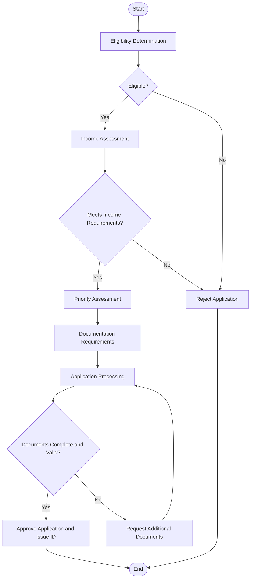

# Decision Flow Architecture for Student Meal Eligibility

This document defines the decision flow architecture for the student meal eligibility system using the JSON Decision Model (JDM) format for the GoRules Zen rules engine.

## Introduction to JSON Decision Model

The JSON Decision Model (JDM) is a format for representing decision logic in a structured, machine-readable way. It is used by the GoRules Zen rules engine to execute rules and make decisions. JDM consists of several components:

1. **Schemas**: Define the structure of input and output data
2. **Decision Tables**: Define rules in a tabular format with conditions and actions
3. **Decision Trees**: Define rules in a tree structure with branches and leaves
4. **Rule Flows**: Define the flow of execution between different decisions

## Overall Decision Flow

The overall decision flow for the student meal eligibility system follows the structure identified in the analysis phase:

1. **Eligibility Determination**: Determine if the student meets basic eligibility criteria
2. **Income Assessment**: Determine if the student meets income requirements
3. **Priority Assessment**: Determine the student's priority status if funding is insufficient
4. **Documentation Requirements**: Determine the required documentation
5. **Application Processing**: Process the application and issue a special ID if eligible
6. **Final Result Collection**: Collect all outputs from previous steps and return them as the final result

The following diagram illustrates the high-level decision flow:



## JSON Decision Model Structure

The JDM structure for the student meal eligibility system consists of the following components:

### 1. Main Rule Flow

The main rule flow orchestrates the overall decision-making process:

```json
{
  "id": "student_meal_eligibility",
  "name": "Student Meal Eligibility",
  "description": "Determines if a student is eligible for free meals",
  "version": "1.0.0",
  "type": "flow",
  "metadata": {
    "author": "Rules as Code Team",
    "createdAt": "2025-03-28",
    "updatedAt": "2025-03-28",
    "legalProvisions": ["Student Meal Eligibility Regulation"]
  },
  "input": {
    "$ref": "schemas/student.json"
  },
  "output": {
    "type": "object",
    "properties": {
      "eligible": {
        "type": "boolean",
        "description": "Whether the student is eligible for free meals"
      },
      "reason": {
        "type": "string",
        "description": "Reason for the eligibility decision"
      },
      "priorityScore": {
        "type": "number",
        "description": "Priority score for the student"
      },
      "requiredDocuments": {
        "type": "array",
        "items": {
          "type": "string"
        },
        "description": "List of required documents"
      },
      "confidence": {
        "type": "object",
        "properties": {
          "value": {
            "type": "number",
            "description": "Confidence value (0.0 to 1.0)"
          },
          "level": {
            "type": "string",
            "description": "Confidence level (HIGH, MEDIUM, LOW, INSUFFICIENT)"
          },
          "reason": {
            "type": "string",
            "description": "Reason for the confidence level"
          },
          "requiresReview": {
            "type": "boolean",
            "description": "Whether human review is required"
          }
        }
      }
    },
    "required": ["eligible", "reason", "confidence"]
  },
  "nodes": [
    {
      "id": "start",
      "type": "start",
      "next": "check_basic_eligibility"
    },
    {
      "id": "check_basic_eligibility",
      "type": "decision",
      "name": "Check Basic Eligibility",
      "decision": "eligibility_determination",
      "next": "eligibility_gateway"
    },
    {
      "id": "eligibility_gateway",
      "type": "gateway",
      "name": "Eligibility Gateway",
      "conditions": [
        {
          "condition": "result.eligible === true",
          "next": "check_income_eligibility"
        },
        {
          "condition": "result.eligible === false",
          "next": "reject_application"
        }
      ]
    },
    {
      "id": "check_income_eligibility",
      "type": "decision",
      "name": "Check Income Eligibility",
      "decision": "income_assessment",
      "next": "income_gateway"
    },
    {
      "id": "income_gateway",
      "type": "gateway",
      "name": "Income Gateway",
      "conditions": [
        {
          "condition": "result.meetsIncomeRequirements === true",
          "next": "assess_priority"
        },
        {
          "condition": "result.meetsIncomeRequirements === false",
          "next": "reject_application"
        }
      ]
    },
    {
      "id": "assess_priority",
      "type": "decision",
      "name": "Assess Priority",
      "decision": "priority_assessment",
      "next": "determine_required_documentation"
    },
    {
      "id": "determine_required_documentation",
      "type": "decision",
      "name": "Determine Required Documentation",
      "decision": "documentation_requirements",
      "next": "process_application"
    },
    {
      "id": "process_application",
      "type": "decision",
      "name": "Process Application",
      "decision": "application_processing",
      "next": "documentation_gateway"
    },
    {
      "id": "documentation_gateway",
      "type": "gateway",
      "name": "Documentation Gateway",
      "conditions": [
        {
          "condition": "result.documentsCompleteAndValid === true",
          "next": "approve_application"
        },
        {
          "condition": "result.documentsCompleteAndValid === false",
          "next": "request_additional_documents"
        }
      ]
    },
    {
      "id": "request_additional_documents",
      "type": "task",
      "name": "Request Additional Documents",
      "action": {
        "type": "function",
        "body": "return { requestAdditionalDocuments: true, missingDocuments: input.missingDocuments };"
      },
      "next": "process_application"
    },
    {
      "id": "approve_application",
      "type": "task",
      "name": "Approve Application",
      "action": {
        "type": "function",
        "body": "return { eligible: true, reason: 'MEETS_ALL_REQUIREMENTS', priorityScore: input.priorityScore, requiredDocuments: input.requiredDocuments, confidence: input.confidence };"
      },
      "next": "end"
    },
    {
      "id": "reject_application",
      "type": "task",
      "name": "Reject Application",
      "action": {
        "type": "function",
        "body": "return { eligible: false, reason: input.reason || 'DOES_NOT_MEET_REQUIREMENTS', confidence: input.confidence };"
      },
      "next": "end"
    },
    {
      "id": "end",
      "type": "end"
    }
  ]
}
```

### 2. Eligibility Determination Flow

The eligibility determination flow determines if a student meets the basic eligibility criteria:

```json
{
  "id": "eligibility_determination",
  "name": "Eligibility Determination",
  "description": "Determines if a student meets basic eligibility criteria",
  "version": "1.0.0",
  "type": "flow",
  "metadata": {
    "author": "Rules as Code Team",
    "createdAt": "2025-03-28",
    "updatedAt": "2025-03-28",
    "legalProvisions": ["Article 1.1 - Basic Eligibility Criteria"]
  },
  "input": {
    "$ref": "schemas/student.json"
  },
  "output": {
    "type": "object",
    "properties": {
      "eligible": {
        "type": "boolean",
        "description": "Whether the student meets basic eligibility criteria"
      },
      "reason": {
        "type": "string",
        "description": "Reason for the eligibility decision"
      },
      "confidence": {
        "type": "object",
        "properties": {
          "value": {
            "type": "number",
            "description": "Confidence value (0.0 to 1.0)"
          },
          "level": {
            "type": "string",
            "description": "Confidence level (HIGH, MEDIUM, LOW, INSUFFICIENT)"
          },
          "reason": {
            "type": "string",
            "description": "Reason for the confidence level"
          },
          "requiresReview": {
            "type": "boolean",
            "description": "Whether human review is required"
          }
        }
      }
    },
    "required": ["eligible", "reason", "confidence"]
  },
  "nodes": [
    {
      "id": "start",
      "type": "start",
      "next": "check_active_student_status"
    },
    {
      "id": "check_active_student_status",
      "type": "decision",
      "name": "Check Active Student Status",
      "decision": "active_student_determination",
      "next": "active_student_gateway"
    },
    {
      "id": "active_student_gateway",
      "type": "gateway",
      "name": "Active Student Gateway",
      "conditions": [
        {
          "condition": "result.isActive === true",
          "next": "check_previous_degree_status"
        },
        {
          "condition": "result.isActive === false",
          "next": "check_visiting_student_status"
        }
      ]
    },
    {
      "id": "check_previous_degree_status",
      "type": "decision",
      "name": "Check Previous Degree Status",
      "decision": "previous_degree_check",
      "next": "previous_degree_gateway"
    },
    {
      "id": "previous_degree_gateway",
      "type": "gateway",
      "name": "Previous Degree Gateway",
      "conditions": [
        {
          "condition": "result.hasSameLevelDegree === false",
          "next": "eligible_basic"
        },
        {
          "condition": "result.hasSameLevelDegree === true",
          "next": "check_visiting_student_status"
        }
      ]
    },
    {
      "id": "check_visiting_student_status",
      "type": "decision",
      "name": "Check Visiting Student Status",
      "decision": "visiting_student_check",
      "next": "visiting_student_gateway"
    },
    {
      "id": "visiting_student_gateway",
      "type": "gateway",
      "name": "Visiting Student Gateway",
      "conditions": [
        {
          "condition": "result.isEligibleVisitingStudent === true",
          "next": "eligible_visiting"
        },
        {
          "condition": "result.isEligibleVisitingStudent === false",
          "next": "check_transfer_student_status"
        }
      ]
    },
    {
      "id": "check_transfer_student_status",
      "type": "decision",
      "name": "Check Transfer Student Status",
      "decision": "transfer_student_check",
      "next": "transfer_student_gateway"
    },
    {
      "id": "transfer_student_gateway",
      "type": "gateway",
      "name": "Transfer Student Gateway",
      "conditions": [
        {
          "condition": "result.isEligibleTransferStudent === true",
          "next": "eligible_transfer"
        },
        {
          "condition": "result.isEligibleTransferStudent === false",
          "next": "check_foreign_scholarship_status"
        }
      ]
    },
    {
      "id": "check_foreign_scholarship_status",
      "type": "decision",
      "name": "Check Foreign Scholarship Status",
      "decision": "foreign_scholarship_check",
      "next": "foreign_scholarship_gateway"
    },
    {
      "id": "foreign_scholarship_gateway",
      "type": "gateway",
      "name": "Foreign Scholarship Gateway",
      "conditions": [
        {
          "condition": "result.isEligibleForeignScholarshipRecipient === true",
          "next": "eligible_foreign_scholarship"
        },
        {
          "condition": "result.isEligibleForeignScholarshipRecipient === false",
          "next": "not_eligible"
        }
      ]
    },
    {
      "id": "eligible_basic",
      "type": "task",
      "name": "Eligible (Basic)",
      "action": {
        "type": "function",
        "body": "return { eligible: true, reason: 'MEETS_BASIC_ELIGIBILITY', confidence: { value: 0.9, level: 'HIGH', reason: 'Clear eligibility under Article 1.1', requiresReview: false } };"
      },
      "next": "end"
    },
    {
      "id": "eligible_visiting",
      "type": "task",
      "name": "Eligible (Visiting)",
      "action": {
        "type": "function",
        "body": "return { eligible: true, reason: 'ELIGIBLE_VISITING_STUDENT', confidence: { value: 0.9, level: 'HIGH', reason: 'Clear eligibility under Article 1.2', requiresReview: false } };"
      },
      "next": "end"
    },
    {
      "id": "eligible_transfer",
      "type": "task",
      "name": "Eligible (Transfer)",
      "action": {
        "type": "function",
        "body": "return { eligible: true, reason: 'ELIGIBLE_TRANSFER_STUDENT', confidence: { value: 0.9, level: 'HIGH', reason: 'Clear eligibility under Article 1.3', requiresReview: false } };"
      },
      "next": "end"
    },
    {
      "id": "eligible_foreign_scholarship",
      "type": "task",
      "name": "Eligible (Foreign Scholarship)",
      "action": {
        "type": "function",
        "body": "return { eligible: true, reason: 'ELIGIBLE_FOREIGN_SCHOLARSHIP_RECIPIENT', confidence: { value: 0.8, level: 'MEDIUM', reason: 'Eligibility under Article 1.4 with circular dependency resolution', requiresReview: true } };"
      },
      "next": "end"
    },
    {
      "id": "not_eligible",
      "type": "task",
      "name": "Not Eligible",
      "action": {
        "type": "function",
        "body": "return { eligible: false, reason: 'DOES_NOT_MEET_ELIGIBILITY_CRITERIA', confidence: { value: 0.9, level: 'HIGH', reason: 'Does not meet any eligibility criteria', requiresReview: false } };"
      },
      "next": "end"
    },
    {
      "id": "end",
      "type": "end"
    }
  ]
}
```

### 3. Income Assessment Flow

The income assessment flow determines if a student meets the income requirements:

```json
{
  "id": "income_assessment",
  "name": "Income Assessment",
  "description": "Determines if a student meets income requirements",
  "version": "1.0.0",
  "type": "flow",
  "metadata": {
    "author": "Rules as Code Team",
    "createdAt": "2025-03-28",
    "updatedAt": "2025-03-28",
    "legalProvisions": ["Article 2 - Income Requirements"]
  },
  "input": {
    "$ref": "schemas/student.json"
  },
  "output": {
    "type": "object",
    "properties": {
      "meetsIncomeRequirements": {
        "type": "boolean",
        "description": "Whether the student meets income requirements"
      },
      "reason": {
        "type": "string",
        "description": "Reason for the income assessment decision"
      },
      "baseThreshold": {
        "type": "number",
        "description": "Base income threshold"
      },
      "adjustedThreshold": {
        "type": "number",
        "description": "Adjusted income threshold"
      },
      "confidence": {
        "type": "object",
        "properties": {
          "value": {
            "type": "number",
            "description": "Confidence value (0.0 to 1.0)"
          },
          "level": {
            "type": "string",
            "description": "Confidence level (HIGH, MEDIUM, LOW, INSUFFICIENT)"
          },
          "reason": {
            "type": "string",
            "description": "Reason for the confidence level"
          },
          "requiresReview": {
            "type": "boolean",
            "description": "Whether human review is required"
          }
        }
      }
    },
    "required": ["meetsIncomeRequirements", "reason", "confidence"]
  },
  "nodes": [
    {
      "id": "start",
      "type": "start",
      "next": "check_unemployment_exception"
    },
    {
      "id": "check_unemployment_exception",
      "type": "decision",
      "name": "Check Unemployment Exception",
      "decision": "unemployment_exception_check",
      "next": "unemployment_gateway"
    },
    {
      "id": "unemployment_gateway",
      "type": "gateway",
      "name": "Unemployment Gateway",
      "conditions": [
        {
          "condition": "result.qualifiesForUnemploymentException === true",
          "next": "exempt_unemployment"
        },
        {
          "condition": "result.qualifiesForUnemploymentException === false",
          "next": "determine_applicable_threshold"
        }
      ]
    },
    {
      "id": "determine_applicable_threshold",
      "type": "decision",
      "name": "Determine Applicable Threshold",
      "decision": "income_threshold_determination",
      "next": "apply_family_adjustments"
    },
    {
      "id": "apply_family_adjustments",
      "type": "decision",
      "name": "Apply Family Adjustments",
      "decision": "family_adjustments",
      "next": "apply_local_residence_adjustment"
    },
    {
      "id": "apply_local_residence_adjustment",
      "type": "decision",
      "name": "Apply Local Residence Adjustment",
      "decision": "local_residence_adjustment",
      "next": "compare_income_to_threshold"
    },
    {
      "id": "compare_income_to_threshold",
      "type": "decision",
      "name": "Compare Income to Threshold",
      "decision": "income_comparison",
      "next": "income_comparison_gateway"
    },
    {
      "id": "income_comparison_gateway",
      "type": "gateway",
      "name": "Income Comparison Gateway",
      "conditions": [
        {
          "condition": "result.incomeWithinThreshold === true",
          "next": "meets_income_requirements"
        },
        {
          "condition": "result.incomeWithinThreshold === false",
          "next": "exceeds_income_threshold"
        }
      ]
    },
    {
      "id": "exempt_unemployment",
      "type": "task",
      "name": "Exempt (Unemployment)",
      "action": {
        "type": "function",
        "body": "return { meetsIncomeRequirements: true, reason: 'EXEMPT_DUE_TO_UNEMPLOYMENT', baseThreshold: null, adjustedThreshold: null, confidence: { value: 0.9, level: 'HIGH', reason: 'Clear exemption under Article 2.4', requiresReview: false } };"
      },
      "next": "end"
    },
    {
      "id": "meets_income_requirements",
      "type": "task",
      "name": "Meets Income Requirements",
      "action": {
        "type": "function",
        "body": "return { meetsIncomeRequirements: true, reason: 'INCOME_WITHIN_THRESHOLD', baseThreshold: input.baseThreshold, adjustedThreshold: input.adjustedThreshold, confidence: { value: 0.9, level: 'HIGH', reason: 'Income within threshold', requiresReview: false } };"
      },
      "next": "end"
    },
    {
      "id": "exceeds_income_threshold",
      "type": "task",
      "name": "Exceeds Income Threshold",
      "action": {
        "type": "function",
        "body": "return { meetsIncomeRequirements: false, reason: 'INCOME_EXCEEDS_THRESHOLD', baseThreshold: input.baseThreshold, adjustedThreshold: input.adjustedThreshold, confidence: { value: 0.9, level: 'HIGH', reason: 'Income exceeds threshold', requiresReview: false } };"
      },
      "next": "end"
    },
    {
      "id": "end",
      "type": "end"
    }
  ]
}
```

### 4. Priority Assessment Flow

The priority assessment flow determines the student's priority status:

```json
{
  "id": "priority_assessment",
  "name": "Priority Assessment",
  "description": "Determines the student's priority status",
  "version": "1.0.0",
  "type": "flow",
  "metadata": {
    "author": "Rules as Code Team",
    "createdAt": "2025-03-28",
    "updatedAt": "2025-03-28",
    "legalProvisions": ["Article 3 - Priority Categories"]
  },
  "input": {
    "$ref": "schemas/student.json"
  },
  "output": {
    "type": "object",
    "properties": {
      "priorityScore": {
        "type": "number",
        "description": "Priority score for the student"
      },
      "priorityCategories": {
        "type": "array",
        "items": {
          "type": "string"
        },
        "description": "List of priority categories the student belongs to"
      },
      "highestPriorityCategory": {
        "type": "string",
        "description": "Highest priority category the student belongs to"
      },
      "hasPriority": {
        "type": "boolean",
        "description": "Whether the student has any priority"
      },
      "confidence": {
        "type": "object",
        "properties": {
          "value": {
            "type": "number",
            "description": "Confidence value (0.0 to 1.0)"
          },
          "level": {
            "type": "string",
            "description": "Confidence level (HIGH, MEDIUM, LOW, INSUFFICIENT)"
          },
          "reason": {
            "type": "string",
            "description": "Reason for the confidence level"
          },
          "requiresReview": {
            "type": "boolean",
            "description": "Whether human review is required"
          }
        }
      }
    },
    "required": ["priorityScore", "priorityCategories", "hasPriority", "confidence"]
  },
  "nodes": [
    {
      "id": "start",
      "type": "start",
      "next": "check_funding_sufficiency"
    },
    {
      "id": "check_funding_sufficiency",
      "type": "decision",
      "name": "Check Funding Sufficiency",
      "decision": "funding_sufficiency_check",
      "next": "funding_gateway"
    },
    {
      "id": "funding_gateway",
      "type": "gateway",
      "name": "Funding Gateway",
      "conditions": [
        {
          "condition": "result.fundingSufficient === false",
          "next": "evaluate_priority_categories"
        },
        {
          "condition": "result.fundingSufficient === true",
          "next": "no_priority_needed"
        }
      ]
    },
    {
      "id": "evaluate_priority_categories",
      "type": "decision",
      "name": "Evaluate Priority Categories",
      "decision": "priority_categories_evaluation",
      "next": "calculate_priority_score"
    },
    {
      "id": "calculate_priority_score",
      "type": "decision",
      "name": "Calculate Priority Score",
      "decision": "priority_score_calculation",
      "next": "end"
    },
    {
      "id": "no_priority_needed",
      "type": "task",
      "name": "No Priority Needed",
      "action": {
        "type": "function",
        "body": "return { priorityScore: 0, priorityCategories: [], highestPriorityCategory: null, hasPriority: false, confidence: { value: 0.9, level: 'HIGH', reason: 'Sufficient funding for all eligible students', requiresReview: false } };"
      },
      "next": "end"
    },
    {
      "id": "end",
      "type": "end"
    }
  ]
}
```

### 5. Documentation Requirements Flow

The documentation requirements flow determines the required documentation:

```json
{
  "id": "documentation_requirements",
  "name": "Documentation Requirements",
  "description": "Determines the required documentation",
  "version": "1.0.0",
  "type": "flow",
  "metadata": {
    "author": "Rules as Code Team",
    "createdAt": "2025-03-28",
    "updatedAt": "2025-03-28",
    "legalProvisions": ["Article 4 - Documentation Requirements"]
  },
  "input": {
    "$ref": "schemas/student.json"
  },
  "output": {
    "type": "object",
    "properties": {
      "requiredDocuments": {
        "type": "array",
        "items": {
          "type": "string"
        },
        "description": "List of required documents"
      },
      "documentationReason": {
        "type": "array",
        "items": {
          "type": "string"
        },
        "description": "Reasons for requiring each document"
      },
      "confidence": {
        "type": "object",
        "properties": {
          "value": {
            "type": "number",
            "description": "Confidence value (0.0 to 1.0)"
          },
          "level": {
            "type": "string",
            "description": "Confidence level (HIGH, MEDIUM, LOW, INSUFFICIENT)"
          },
          "reason": {
            "type": "string",
            "description": "Reason for the confidence level"
          },
          "requiresReview": {
            "type": "boolean",
            "description": "Whether human review is required"
          }
        }
      }
    },
    "required": ["requiredDocuments", "confidence"]
  },
  "nodes": [
    {
      "id": "start",
      "type": "start",
      "next": "determine_base_documentation"
    },
    {
      "id": "determine_base_documentation",
      "type": "decision",
      "name": "Determine Base Documentation",
      "decision": "base_documentation",
      "next": "check_unemployment_exception"
    },
    {
      "id": "check_unemployment_exception",
      "type": "decision",
      "name": "Check Unemployment Exception",
      "decision": "unemployment_documentation_check",
      "next": "unemployment_gateway"
    },
    {
      "id": "unemployment_gateway",
      "type": "gateway",
      "name": "Unemployment Gateway",
      "conditions": [
        {
          "condition": "result.claimsUnemploymentException === true",
          "next": "add_unemployment_documentation"
        },
        {
          "condition": "result.claimsUnemploymentException === false",
          "next": "check_income_based_eligibility"
        }
      ]
    },
    {
      "id": "add_unemployment_documentation",
      "type": "task",
      "name": "Add Unemployment Documentation",
      "action": {
        "type": "function",
        "body": "return { ...input, requiredDocuments: [...input.requiredDocuments, 'UNEMPLOYMENT_BENEFIT_CERTIFICATE'], documentationReason: [...input.documentationReason, 'CLAIMS_UNEMPLOYMENT_EXCEPTION'] };"
      },
      "next": "check_priority_claims"
    },
    {
      "id": "check_income_based_eligibility",
      "type": "decision",
      "name": "Check Income-Based Eligibility",
      "decision": "income_documentation_check",
      "next": "income_gateway"
    },
    {
      "id": "income_gateway",
      "type": "gateway",
      "name": "Income Gateway",
      "conditions": [
        {
          "condition": "result.claimsIncomeBasedEligibility === true",
          "next": "add_income_documentation"
        },
        {
          "condition": "result.claimsIncomeBasedEligibility === false",
          "next": "check_priority_claims"
        }
      ]
    },
    {
      "id": "add_income_documentation",
      "type": "task",
      "name": "Add Income Documentation",
      "action": {
        "type": "function",
        "body": "return { ...input, requiredDocuments: [...input.requiredDocuments, 'TAX_CLEARANCE_CERTIFICATE'], documentationReason: [...input.documentationReason, 'CLAIMS_INCOME_BASED_ELIGIBILITY'] };"
      },
      "next": "check_priority_claims"
    },
    {
      "id": "check_priority_claims",
      "type": "decision",
      "name": "Check Priority Claims",
      "decision": "priority_documentation_check",
      "next": "finalize_documentation"
    },
    {
      "id": "finalize_documentation",
      "type": "task",
      "name": "Finalize Documentation",
      "action": {
        "type": "function",
        "body": "return { requiredDocuments: input.requiredDocuments, documentationReason: input.documentationReason, confidence: { value: 0.9, level: 'HIGH', reason: 'Clear documentation requirements', requiresReview: false } };"
      },
      "next": "end"
    },
    {
      "id": "end",
      "type": "end"
    }
  ]
}
```

### 6. Application Processing Flow

The application processing flow processes the application and issues a special ID if eligible:

```json
{
  "id": "application_processing",
  "name": "Application Processing",
  "description": "Processes the application and issues a special ID if eligible",
  "version": "1.0.0",
  "type": "flow",
  "metadata": {
    "author": "Rules as Code Team",
    "createdAt": "2025-03-28",
    "updatedAt": "2025-03-28",
    "legalProvisions": ["Article 5 - Application Processing"]
  },
  "input": {
    "$ref": "schemas/application.json"
  },
  "output": {
    "type": "object",
    "properties": {
      "documentsCompleteAndValid": {
        "type": "boolean",
        "description": "Whether the documents are complete and valid"
      },
      "missingDocuments": {
        "type": "array",
        "items": {
          "type": "string"
        },
        "description": "List of missing documents"
      },
      "specialIDIssued": {
        "type": "boolean",
        "description": "Whether a special ID was issued"
      },
      "specialID": {
        "type": "object",
        "description": "Special ID details"
      },
      "confidence": {
        "type": "object",
        "properties": {
          "value": {
            "type": "number",
            "description": "Confidence value (0.0 to 1.0)"
          },
          "level": {
            "type": "string",
            "description": "Confidence level (HIGH, MEDIUM, LOW, INSUFFICIENT)"
          },
          "reason": {
            "type": "string",
            "description": "Reason for the confidence level"
          },
          "requiresReview": {
            "type": "boolean",
            "description": "Whether human review is required"
          }
        }
      }
    },
    "required": ["documentsCompleteAndValid", "confidence"]
  },
  "nodes": [
    {
      "id": "start",
      "type": "start",
      "next": "verify_application_submission"
    },
    {
      "id": "verify_application_submission",
      "type": "decision",
      "name": "Verify Application Submission",
      "decision": "application_submission_verification",
      "next": "submission_gateway"
    },
    {
      "id": "submission_gateway",
      "type": "gateway",
      "name": "Submission Gateway",
      "conditions": [
        {
          "condition": "result.submissionValid === true",
          "next": "verify_document_authenticity"
        },
        {
          "condition": "result.submissionValid === false",
          "next": "invalid_submission"
        }
      ]
    },
    {
      "id": "verify_document_authenticity",
      "type": "decision",
      "name": "Verify Document Authenticity",
      "decision": "document_authenticity_verification",
      "next": "document_gateway"
    },
    {
      "id": "document_gateway",
      "type": "gateway",
      "name": "Document Gateway",
      "conditions": [
        {
          "condition": "result.documentsValid === true",
          "next": "check_document_completeness"
        },
        {
          "condition": "result.documentsValid === false",
          "next": "invalid_documents"
        }
      ]
    },
    {
      "id": "check_document_completeness",
      "type": "decision",
      "name": "Check Document Completeness",
      "decision": "document_completeness_check",
      "next": "completeness_gateway"
    },
    {
      "id": "completeness_gateway",
      "type": "gateway",
      "name": "Completeness Gateway",
      "conditions": [
        {
          "condition": "result.documentsComplete === true",
          "next": "issue_special_id"
        },
        {
          "condition": "result.documentsComplete === false",
          "next": "incomplete_documents"
        }
      ]
    },
    {
      "id": "issue_special_id",
      "type": "decision",
      "name": "Issue Special ID",
      "decision": "special_id_issuance",
      "next": "id_gateway"
    },
    {
      "id": "id_gateway",
      "type": "gateway",
      "name": "ID Gateway",
      "conditions": [
        {
          "condition": "result.idIssued === true",
          "next": "documents_complete_and_valid"
        },
        {
          "condition": "result.idIssued === false",
          "next": "id_issuance_failed"
        }
      ]
    },
    {
      "id": "documents_complete_and_valid",
      "type": "task",
      "name": "Documents Complete and Valid",
      "action": {
        "type": "function",
        "body": "return { documentsCompleteAndValid: true, specialIDIssued: true, specialID: input.specialID, confidence: { value: 0.9, level: 'HIGH', reason: 'All documents complete and valid', requiresReview: false } };"
      },
      "next": "end"
    },
    {
      "id": "invalid_submission",
      "type": "task",
      "name": "Invalid Submission",
      "action": {
        "type": "function",
        "body": "return { documentsCompleteAndValid: false, missingDocuments: [], reason: 'INVALID_SUBMISSION', confidence: { value: 0.9, level: 'HIGH', reason: 'Application submission invalid', requiresReview: false } };"
      },
      "next": "end"
    },
    {
      "id": "invalid_documents",
      "type": "task",
      "name": "Invalid Documents",
      "action": {
        "type": "function",
        "body": "return { documentsCompleteAndValid: false, missingDocuments: [], reason: 'INVALID_DOCUMENTS', confidence: { value: 0.9, level: 'HIGH', reason: 'Documents invalid', requiresReview: false } };"
      },
      "next": "end"
    },
    {
      "id": "incomplete_documents",
      "type": "task",
      "name": "Incomplete Documents",
      "action": {
        "type": "function",
        "body": "return { documentsCompleteAndValid: false, missingDocuments: input.missingDocuments, reason: 'INCOMPLETE_DOCUMENTS', confidence: { value: 0.9, level: 'HIGH', reason: 'Documents incomplete', requiresReview: false } };"
      },
      "next": "end"
    },
    {
      "id": "id_issuance_failed",
      "type": "task",
      "name": "ID Issuance Failed",
      "action": {
        "type": "function",
        "body": "return { documentsCompleteAndValid: true, specialIDIssued: false, reason: 'ID_ISSUANCE_FAILED', confidence: { value: 0.9, level: 'HIGH', reason: 'ID issuance failed', requiresReview: true } };"
      },
      "next": "end"
    },
    {
      "id": "end",
      "type": "end"
    }
  ]
}
```

## Benefits of JSON Decision Model

Using the JSON Decision Model (JDM) format for the student meal eligibility system provides several benefits:

1. **Structured Representation**: JDM provides a structured, machine-readable representation of the decision logic, making it easier to understand, maintain, and evolve.

2. **Separation of Concerns**: The decision flow is separated from the decision logic, allowing for independent development and testing of each component.

3. **Traceability**: Each decision and rule can be traced back to the legal provisions that inform it, providing transparency and accountability.

4. **Confidence Scoring**: The model includes confidence scoring for each decision, allowing for the identification of decisions that require human review.

5. **Extensibility**: The model can be extended to include additional decisions, rules, and flows as needed, without disrupting existing functionality.

## Next Steps

With the decision flow architecture defined, we can now proceed to implement the rule logic for each decision in the flow. This will involve creating decision tables and decision trees for each decision, and implementing the functions that evaluate the rules and return the results.
