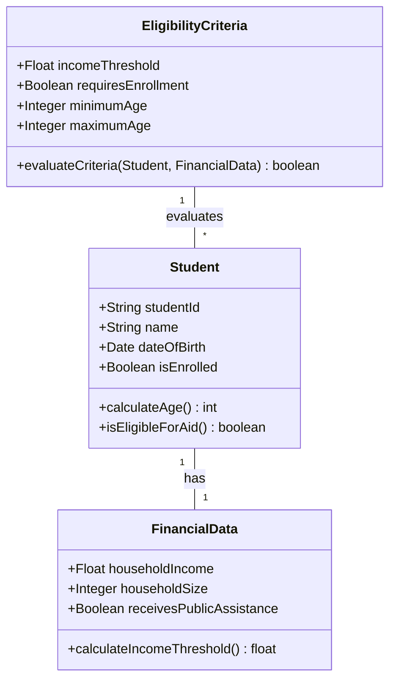
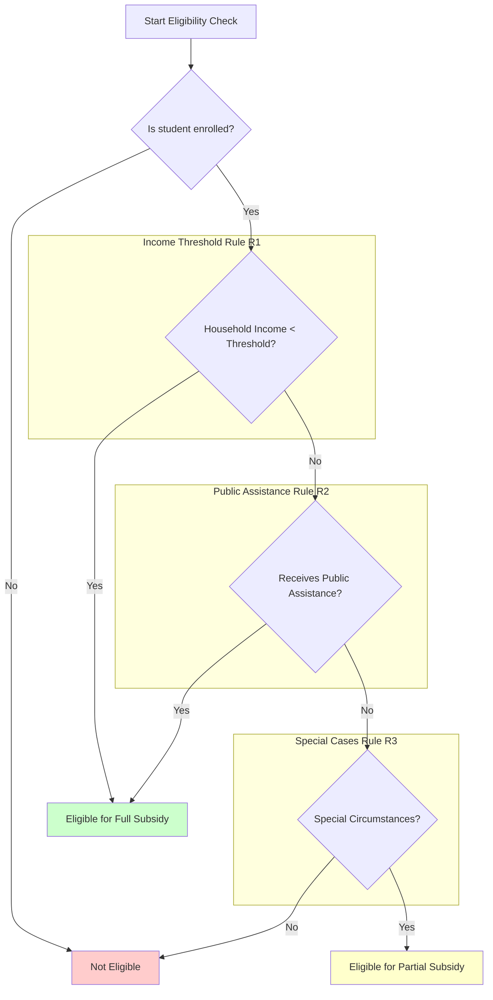
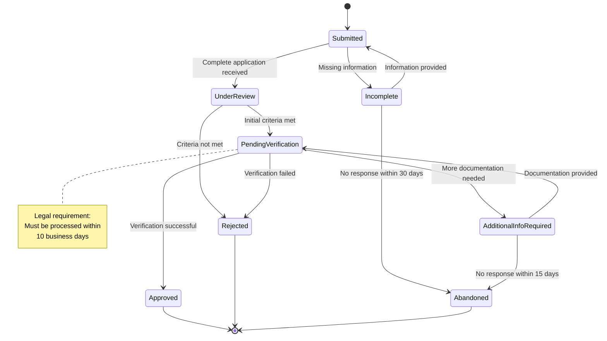
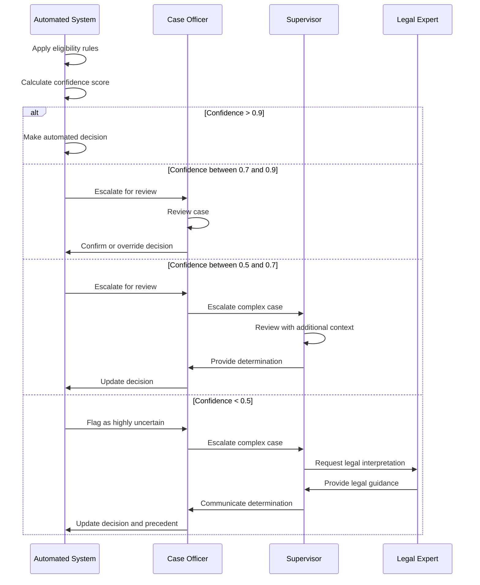
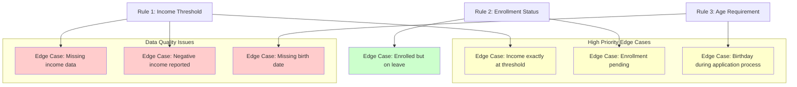
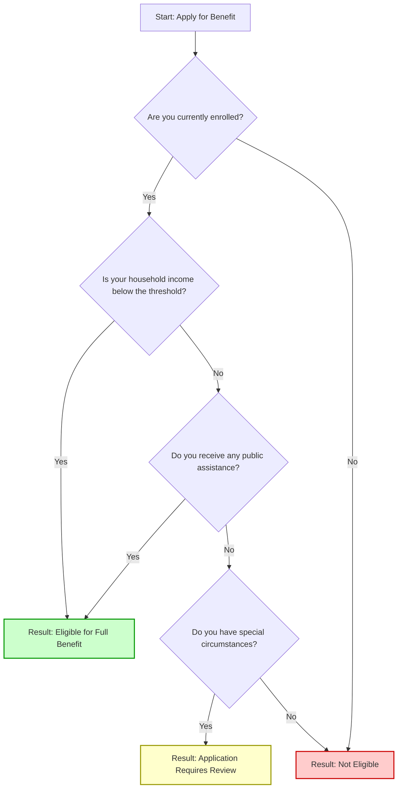

# Refined Integrated LLM-Assisted Rules as Code Methodology

This document presents a comprehensive methodology for using Large Language Models (LLMs) to assist in the analysis and implementation of Rules as Code, with integrated handling of legal inconsistencies.

## 1. Introduction

Rules as Code is an approach to implementing legal and policy rules in machine-executable form. Large Language Models (LLMs) offer powerful capabilities to assist in this process, from initial analysis of legal text to implementation and validation of code. This methodology integrates LLM assistance throughout the Rules as Code lifecycle, with specific focus on handling legal inconsistencies, ambiguities, and contradictions.

The methodology acknowledges that legal ambiguities and contradictions are inherent challenges rather than exceptional cases. By embedding detection, resolution, and documentation of inconsistencies at every phase, it produces more robust implementations that can handle the complexities of real-world legal texts.

This methodology positions LLMs as tools to enhance human legal experts' capabilities rather than replace them. The approach embraces an augmented intelligence paradigm where LLMs assist experts by providing initial analyses, identifying potential issues, and suggesting structured representations, while human experts provide critical oversight, domain knowledge, and final decision-making authority. This collaborative approach leverages the complementary strengths of both LLMs and human experts to produce more robust and accurate implementations.

## 2. Methodology Overview

The integrated methodology consists of seven phases:

1. **Preparation Phase**: Preprocessing legal text and establishing initial guidance
2. **Comprehensive Analysis Phase**: Analyzing entities, rules, and data requirements
3. **Design and Implementation Phase**: Creating data models and implementing rule logic
4. **Validation and Testing Phase**: Ensuring completeness, consistency, and handling of edge cases
5. **Documentation and Transparency Phase**: Documenting assumptions, interpretations, and decisions
6. **Continuous Improvement Phase**: Collecting feedback and refining the implementation
7. **Governance and Oversight**: Establishing authority and accountability for interpretative decisions

Each phase incorporates specific techniques for handling legal inconsistencies and ambiguities, with explicit human verification points to ensure accuracy and accountability.

## 3. Preparation Phase

### 3.1. Text Preprocessing

#### 3.1.1 Segment Legal Text

Break the legal text into logical sections for more focused analysis:

```
Function SegmentText(legalText):
    prompt = "Divide this legal text into logical sections"
    return LLM.Process(prompt, legalText)
```

#### 3.1.2 Normalize Terminology

Standardize terminology across sections for consistency:

```
Function NormalizeTerminology(sections):
    normalizedSections = []
    For each section in sections:
        prompt = "Standardize all terminology in this text: " + section
        normalizedSections.Add(LLM.Process(prompt, section))
    Return normalizedSections
```

#### 3.1.3 Identify Key Sections

Focus on the most important sections for implementation:

```
Function IdentifyKeySections(normalizedSections):
    prompt = "Identify the most important sections of this legal text for implementation"
    return LLM.Process(prompt, normalizedSections)
```

#### 3.1.4 Inconsistency Scanning

Perform initial identification of potential contradictions, ambiguities, and gaps:

```
Function ScanForInconsistencies(normalizedSections):
    inconsistencies = []
    For each section in normalizedSections:
        prompt = "Analyze this text and identify inconsistencies, contradictions, or ambiguities"
        sectionInconsistencies = LLM.Process(prompt, section)
        inconsistencies.AddRange(sectionInconsistencies)

    // Cross-section inconsistency analysis (new)
    prompt = "Analyze these sections together and identify inconsistencies between different sections"
    crossSectionInconsistencies = LLM.Process(prompt, normalizedSections)
    inconsistencies.AddRange(crossSectionInconsistencies)

    // Categorize inconsistencies by type and severity (new)
    categorizedInconsistencies = CategorizeInconsistencies(inconsistencies)

    Return categorizedInconsistencies
```

#### 3.1.5 Categorize Inconsistencies

Categorize identified inconsistencies by type and severity:

```
Function CategorizeInconsistencies(inconsistencies):
    categorized = {
        "contradictions": [],
        "ambiguities": [],
        "gaps": [],
        "overlaps": []
    }

    For each inconsistency in inconsistencies:
        prompt = "Categorize this inconsistency as contradiction, ambiguity, gap, or overlap, and assign a severity level (high, medium, low)"
        categorization = LLM.Process(prompt, inconsistency)
        categorized[categorization.type].Add({
            "description": inconsistency,
            "severity": categorization.severity,
            "affectedSections": categorization.affectedSections
        })

    Return categorized
```

### 3.2 Initial Human Guidance

#### 3.2.1 Define Project Scope and Objectives

Establish clear boundaries and goals for the Rules as Code project:

- Identify which parts of the legal text will be implemented
- Define the intended use cases for the implementation
- Establish success criteria for the project

#### 3.2.2 Identify Critical Legal Concepts

Highlight concepts that require special attention:

- Complex legal terms with specific meanings
- Concepts that may be interpreted differently in different contexts
- Terms that have evolved in meaning over time

#### 3.2.3 Establish Validation Criteria

Define how LLM outputs will be validated:

- Accuracy thresholds for different types of analysis
- Required review processes for different outputs
- Documentation requirements for validation decisions

#### 3.2.4 Inconsistency Framework

Establish principles for resolving inconsistencies:

```
Function DocumentResolutionPrinciples():
    resolutionPrinciples = {
        "lex_specialis": "More specific rules override general ones",
        "lex_posterior": "More recent rules override older ones",
        "lex_superior": "Higher-authority rules override lower-authority ones",
        "legislative_intent": "Consider the purpose behind the legislation"
    }

    prioritizedPrinciples = GetHumanInput(
        "Please rank these principles for resolving inconsistencies",
        resolutionPrinciples
    )

    // Add specific resolution strategies for identified inconsistencies (new)
    specificStrategies = {}
    For each category, inconsistencies in categorizedInconsistencies:
        For each inconsistency in inconsistencies:
            if inconsistency.severity == "high":
                specificStrategies[inconsistency.description] = GetHumanInput(
                    "Please provide a specific resolution strategy for this high-severity inconsistency",
                    inconsistency
                )

    Return {
        "generalPrinciples": prioritizedPrinciples,
        "specificStrategies": specificStrategies
    }
```

#### 3.2.5 Uncertainty Parameters

Define confidence thresholds and escalation criteria:

```
Function DefineConfidenceThresholds():
    confidenceThresholds = {
        "high": 0.9,    // No human review needed
        "medium": 0.7,  // Selective human review
        "low": 0.5,     // Always requires human review
        "minimum": 0.3  // Insufficient for any automated decision
    }

    // Add specific thresholds for different types of decisions (new)
    decisionTypeThresholds = {
        "eligibility": 0.85,  // Higher threshold for eligibility decisions
        "calculation": 0.8,   // Threshold for financial calculations
        "documentation": 0.75, // Threshold for documentation requirements
        "procedural": 0.7     // Lower threshold for procedural decisions
    }

    Return {
        "general": confidenceThresholds,
        "byDecisionType": decisionTypeThresholds
    }
```

### 3.3 Visual Modeling Planning

#### 3.3.1 Identify Visualization Needs

Determine which aspects of the legal text will benefit from visual modeling:

```
Function IdentifyVisualizationNeeds(legalText, projectScope):
    prompt = "Identify aspects of this legal text that would benefit from visual modeling"
    visualizationNeeds = LLM.Process(prompt, {
        "legalText": legalText,
        "projectScope": projectScope
    })

    Return visualizationNeeds
```

#### 3.3.2 Plan Progressive Diagram Approach

Adopt a tiered approach to diagrams, starting with essential visualizations and adding complexity only when necessary:

```
Function PlanDiagramApproach(visualizationNeeds):
    // Identify core diagrams needed for all implementations
    coreDiagrams = {
        "entityRelationships": "Class diagrams for entity modeling",
        "decisionFlows": "Flowcharts for decision logic"
    }

    // Identify enhanced diagrams for moderately complex implementations
    enhancedDiagrams = {
        "edgeCases": "Maps of boundary conditions and exceptions",
        "processFlows": "Activity diagrams for complex workflows"
    }

    // Identify specialized diagrams for highly complex implementations
    specializedDiagrams = {
        "interactions": "Sequence diagrams for complex component interactions",
        "entityLifecycles": "State machine diagrams for entity state transitions"
    }

    // Assess project complexity to determine which diagram levels to include
    projectComplexity = AssessProjectComplexity(visualizationNeeds)

    diagramPlan = {
        "core": coreDiagrams,
        "enhanced": projectComplexity >= ComplexityThreshold.MEDIUM ? enhancedDiagrams : null,
        "specialized": projectComplexity >= ComplexityThreshold.HIGH ? specializedDiagrams : null,
        "complexity": projectComplexity
    }

    Return diagramPlan
```

#### 3.3.3 Establish Diagram Generation Strategy

Plan for efficient diagram creation throughout the implementation process:

```
Function EstablishDiagramStrategy(diagramPlan):
    // Define diagram generation approach
    generationStrategy = {
        "automationLevel": diagramPlan.complexity > 0.7 ? "high" : "medium",
        "storageFormat": "Mermaid/PlantUML code in version control",
        "updateFrequency": "On significant model changes",
        "reviewProcess": "Human verification of auto-generated diagrams"
    }

    // Define diagram templates for consistency
    diagramTemplates = CreateDiagramTemplates(diagramPlan)

    Return {
        "generationStrategy": generationStrategy,
        "diagramTemplates": diagramTemplates
    }
```

#### 3.3.4 Human Verification Point

Review visualization plan in a collaborative enhancement process:

```
Function VerifyVisualizationPlan(visualizationNeeds, diagramPlan, diagramStrategy):
    Return GetHumanVerification(
        "Please review and enhance the visual modeling plan, leveraging both LLM suggestions and your domain expertise",
        {
            "visualizationNeeds": visualizationNeeds,
            "diagramPlan": diagramPlan,
            "diagramStrategy": diagramStrategy
        }
    )
```

This verification point exemplifies the augmented intelligence approach, where the LLM provides an initial structured plan that the human expert can refine based on their specialized knowledge and experience.

## 4. Comprehensive Analysis Phase

### 4.1 Entity and Data Analysis

#### 4.1.1 Extract Entities and Attributes

Identify all entities mentioned in the legal text:

```
Function ExtractEntities(normalizedSections):
    entities = {}
    For each section in normalizedSections:
        prompt = "Extract all entities (people, organizations, documents, concepts) with attributes"
        sectionEntities = LLM.Process(prompt, section)
        entities.Merge(sectionEntities)
    Return entities
```

Example prompt for entity extraction:

```
Analyze the following legal text and extract all entities (people, organizations, documents, concepts, etc.) mentioned:

[LEGAL TEXT]

For each entity:
1. Provide the entity name
2. Categorize it (person, organization, document, etc.)
3. List all attributes or properties mentioned for this entity
4. Note any relationships with other entities
```

#### 4.1.2 Entity Refinement

After receiving the initial list, refine with a follow-up prompt:

```
Function RefineEntities(entities):
    refinedEntities = {}
    For each entity in entities:
        prompt = "Identify missing attributes, suggest data types, and identify edge cases"
        refinedEntities[entity] = LLM.Process(prompt, entity)
    Return refinedEntities
```

Example refinement prompt:

```
For each of these entities, please:
1. Identify any missing attributes that would be necessary to implement these rules in code
2. Suggest data types for each attribute (string, integer, boolean, date, etc.)
3. Identify any potential edge cases or ambiguities in how these entities are defined
```

#### 4.1.3 Identify Data Requirements

Determine data needs for each entity:

```
Function IdentifyDataRequirements(entities):
    dataRequirements = {}
    For each entity, attributes in entities:
        prompt = "Identify all data inputs required to implement rules for this entity"
        dataRequirements[entity] = LLM.Process(prompt, entity, attributes)
    Return dataRequirements
```

#### 4.1.4 Define Data Types and Validation Rules

Establish data types and validation rules for each attribute:

- Specify appropriate data types (string, number, boolean, date, etc.)
- Define format validation rules (e.g., date format, numeric range)
- Establish cross-field validation requirements
- Identify required documentation for verification

#### 4.1.5 Ambiguity Tagging

Mark entity attributes with ambiguity indicators:

```
Function IdentifyAmbiguousAttributes(entities):
    ambiguousAttributes = {}
    For each entity, attributes in entities:
        prompt = "Identify attributes with ambiguous or unclear definitions"
        ambiguousAttributes[entity] = LLM.Process(prompt, entity, attributes)
    Return ambiguousAttributes
```

#### 4.1.6 Uncertainty Modeling

Design data structures that can represent uncertain or conflicting values:

- Include confidence scores with data points
- Support multiple possible interpretations
- Track provenance of different interpretations
- Implement versioning for evolving interpretations

#### 4.1.7 Entity Relationship Mapping

Create a comprehensive map of relationships between entities:

```
Function MapEntityRelationships(entities):
    prompt = "Identify all relationships between these entities, including cardinality and dependency"
    relationships = LLM.Process(prompt, entities)

    // Always generate UML class diagram (Level 1 - Core Diagram)
    classPrompt = "Create a UML class diagram in Mermaid syntax for these entities and their relationships"
    classDiagram = LLM.Process(classPrompt, {
        "entities": entities,
        "relationships": relationships
    })

    // Assess complexity to determine if additional diagrams are needed
    complexity = AssessModelComplexity(entities, relationships)

    // Only generate ER diagram for complex entity models (Level 3 - Specialized Visualization)
    erDiagram = null
    If complexity > ComplexityThreshold.HIGH:
        erPrompt = "Create an entity relationship diagram in Mermaid syntax for these entities and their relationships"
        erDiagram = LLM.Process(erPrompt, {
            "entities": entities,
            "relationships": relationships
        })

    Return {
        "relationships": relationships,
        "classDiagram": classDiagram,
        "erDiagram": erDiagram,
        "complexity": complexity
    }
}
```

Example Mermaid class diagram output:



#### 4.1.8 Human Verification Point

Collaboratively review and enhance entity definitions, data requirements, ambiguity tags, and visual models:

```
Function VerifyEntities(entities, ambiguousAttributes, relationships, classDiagram, erDiagram):
    Return GetHumanVerification(
        "Please review these entity definitions, ambiguity tags, relationships, and diagrams. Your expertise may identify nuances or domain-specific considerations that enhance the LLM's analysis",
        {
            "entities": entities,
            "ambiguities": ambiguousAttributes,
            "relationships": relationships,
            "classDiagram": classDiagram,
            "erDiagram": erDiagram
        }
    )
```

This collaborative verification leverages both the LLM's ability to extract structured information and the human expert's ability to identify subtle legal nuances and domain-specific considerations.

### 4.2 Rule and Decision Analysis

#### 4.2.1 Extract Rules and Decision Points

Identify all rules in the legal text:

```
Function ExtractRules(normalizedSections):
    rules = []
    For each section in normalizedSections:
        prompt = "Identify all rules, conditions, and decision points"
        sectionRules = LLM.Process(prompt, section)
        rules.AddRange(sectionRules)
    Return rules
```

Example prompt for rule identification:

```
Identify all rules, conditions, and decision points in the following legal text:

[LEGAL TEXT]

For each rule:
1. Assign a unique identifier (e.g., R1, R2)
2. Quote the relevant text from the document
3. Summarize the rule in plain language
4. Identify which entities this rule applies to
```

#### 4.2.2 Formalize Rules

Structure rules in a formal format:

```
Function FormalizeRules(rules):
    formalizedRules = []
    For each rule in rules:
        prompt = "Rewrite this rule in IF-THEN-ELSE format"
        formalizedRules.Add(LLM.Process(prompt, rule))
    Return formalizedRules
```

Example prompt for rule formalization:

```
For each of the following rules, rewrite them in a structured IF-THEN-ELSE format:

[RULES]

Use the following format:
IF [condition]
AND [condition]
...
THEN [outcome]
ELSE [alternative outcome]
```

#### 4.2.3 Map Rule Dependencies

Identify relationships between rules:

```
Function MapRuleDependencies(formalizedRules):
    prompt = "Analyze these rules and identify dependencies between them"
    Return LLM.Process(prompt, formalizedRules)
```

Example prompt for dependency mapping:

```
Analyze the following rules and identify dependencies between them:

[FORMALIZED RULES]

For each rule:
1. Which other rules must be evaluated before this rule?
2. Which rules depend on the outcome of this rule?
3. Are there any circular dependencies?
4. What is the logical sequence for evaluating these rules?
```

#### 4.2.4 Create Decision Requirements Diagrams (DRDs)

Develop formal representations of decision logic:

```
Function CreateDecisionRequirementsDiagram(legalText):
    // Identify decisions
    decisions = LLM.Process("Identify all decisions that need to be made", legalText)

    // Extract input data for decisions
    inputData = LLM.Process("Identify all input data required for these decisions", decisions)

    // Identify knowledge sources
    knowledgeSources = LLM.Process("Identify all knowledge sources",
                                   {"decisions": decisions, "inputData": inputData})

    // Map dependencies
    dependencies = LLM.Process("Identify all dependencies between elements",
                              {"decisions": decisions,
                               "inputData": inputData,
                               "knowledgeSources": knowledgeSources})

    // Generate decision flow diagram in Mermaid
    flowPrompt = "Create a Mermaid flowchart diagram that visualizes the decision logic and dependencies"
    decisionFlowDiagram = LLM.Process(flowPrompt, {
        "decisions": decisions,
        "inputData": inputData,
        "knowledgeSources": knowledgeSources,
        "dependencies": dependencies
    })

    Return {
        "decisions": decisions,
        "inputData": inputData,
        "knowledgeSources": knowledgeSources,
        "dependencies": dependencies,
        "decisionFlowDiagram": decisionFlowDiagram
    }
}
```

Example Mermaid decision flow diagram:



#### 4.2.5 Inconsistency Detection

Identify contradictory rules and logical conflicts:

```
Function DetectRuleConflicts(formalizedRules):
    ruleConflicts = []
    For i = 0 to formalizedRules.Length - 1:
        For j = i + 1 to formalizedRules.Length - 1:
            prompt = "Analyze these two rules for potential conflicts"
            conflict = LLM.Process(prompt, formalizedRules[i], formalizedRules[j])
            If conflict.HasConflict:
                ruleConflicts.Add(conflict)

    // Analyze rule execution paths for conflicts (new)
    executionPathConflicts = AnalyzeExecutionPathConflicts(formalizedRules)
    ruleConflicts.AddRange(executionPathConflicts)

    Return ruleConflicts
```

#### 4.2.6 Analyze Execution Path Conflicts

Identify conflicts that arise from different rule execution paths:

```
Function AnalyzeExecutionPathConflicts(formalizedRules):
    prompt = "Identify potential conflicts that could arise from different rule execution paths"
    return LLM.Process(prompt, formalizedRules)
```

#### 4.2.7 Rule Categorization

Tag rules as deterministic, discretionary, or ambiguous:

```
Function CategorizeRules(formalizedRules):
    categorizedRules = {}
    For each rule in formalizedRules:
        prompt = "Categorize this rule as deterministic, discretionary, or ambiguous"
        categorizedRules[rule.Id] = LLM.Process(prompt, rule)
    Return categorizedRules
```

#### 4.2.8 Conflict Resolution Modeling

Create decision models for handling rule conflicts:

- Define resolution strategies for different types of conflicts
- Establish escalation pathways for conflicts that cannot be resolved automatically
- Document the rationale for each resolution approach

#### 4.2.9 Rule Prioritization

Establish a clear hierarchy of rules for conflict resolution:

```
Function PrioritizeRules(formalizedRules, ruleConflicts):
    // Group rules by domain/category
    ruleDomains = GroupRulesByDomain(formalizedRules)

    // Establish priority within each domain
    domainPriorities = {}
    For each domain, rules in ruleDomains:
        prompt = "Establish a priority hierarchy for these rules"
        domainPriorities[domain] = LLM.Process(prompt, rules)

    // Establish cross-domain priorities
    crossDomainPriorities = LLM.Process(
        "Establish priority relationships between these rule domains",
        ruleDomains
    )

    // Create specific conflict resolution rules
    conflictResolutionRules = {}
    For each conflict in ruleConflicts:
        prompt = "Create a specific resolution rule for this conflict"
        conflictResolutionRules[conflict.Id] = LLM.Process(prompt, conflict)

    Return {
        "domainPriorities": domainPriorities,
        "crossDomainPriorities": crossDomainPriorities,
        "conflictResolutionRules": conflictResolutionRules
    }
```

#### 4.2.10 Human Verification Point

Collaboratively validate and enhance rule formalization, decision models, and conflict resolution approaches:

```
Function VerifyRules(formalizedRules, ruleConflicts, categorizedRules, rulePriorities):
    Return GetHumanVerification(
        "Please review these formalized rules, identified conflicts, and rule priorities. Your legal expertise may identify important nuances or considerations that complement the LLM's analysis",
        {
            "formalizedRules": formalizedRules,
            "ruleConflicts": ruleConflicts,
            "categorizedRules": categorizedRules,
            "rulePriorities": rulePriorities
        }
    )
```

This verification point exemplifies how human legal experts and LLMs can work together to produce more robust rule formalizations, with the LLM providing initial structured analysis and the human expert contributing specialized legal knowledge and judgment.

### 4.3 Process Flow Analysis

#### 4.3.1 Identify Process Flows

Map the procedural aspects of the legal text:

```
Function IdentifyProcessFlows(normalizedSections):
    prompt = "Identify all processes, procedures, and workflows described in this legal text"
    processes = LLM.Process(prompt, normalizedSections)

    // For each process, map the steps
    processSteps = {}
    For each process in processes:
        prompt = "Break down this process into sequential steps"
        processSteps[process.Id] = LLM.Process(prompt, process)

    Return {
        "processes": processes,
        "steps": processSteps
    }
```

#### 4.3.2 Identify Process Gaps

Detect missing steps or unclear transitions in processes:

```
Function IdentifyProcessGaps(processes, steps):
    processGaps = {}
    For each processId, processSteps in steps:
        prompt = "Identify any gaps, unclear transitions, or missing steps in this process"
        processGaps[processId] = LLM.Process(prompt, processSteps)

    Return processGaps
```

#### 4.3.3 Create Process Diagrams

Visualize the processes for better understanding:

```
Function CreateProcessDiagrams(processes, steps):
    diagrams = {}
    For each processId, processSteps in steps:
        // Assess process complexity
        complexity = AssessProcessComplexity(processes[processId], processSteps)

        // Only generate activity diagrams for moderately complex or complex processes (Level 2 - Enhanced Understanding)
        If complexity > ComplexityThreshold.MEDIUM:
            // Generate UML activity diagram in Mermaid syntax
            prompt = "Create a UML activity diagram in Mermaid syntax for this process"
            diagram = LLM.Process(prompt, {
                "process": processes[processId],
                "steps": processSteps
            })
            diagrams[processId] = {
                "diagram": diagram,
                "complexity": complexity
            }
        Else:
            // For simple processes, just provide a textual representation
            prompt = "Create a simple numbered list of steps for this process in plain text"
            textualSteps = LLM.Process(prompt, {
                "process": processes[processId],
                "steps": processSteps
            })
            diagrams[processId] = {
                "textualSteps": textualSteps,
                "complexity": complexity
            }

    Return diagrams
```

Example Mermaid activity diagram:



#### 4.3.4 Human Verification Point

Collaboratively review and enhance process flows and identified gaps:

```
Function VerifyProcesses(processes, steps, gaps, diagrams):
    Return GetHumanVerification(
        "Please review these process flows and identified gaps. Your domain expertise can help refine these processes and identify additional considerations that may not be apparent from the text alone",
        {
            "processes": processes,
            "steps": steps,
            "gaps": gaps,
            "diagrams": diagrams
        }
    )
```

This verification point allows human experts to contribute their practical experience with legal and administrative processes, complementing the LLM's systematic analysis with real-world insights about how processes actually function in practice.

## 5. Design and Implementation Phase

### 5.1 Modeling and Architecture

#### 5.1.1 Design Data Models

Create data models based on verified entities:

```
Function DesignDataModels(verifiedEntities):
    prompt = "Generate a data model based on these entity definitions"
    Return LLM.Process(prompt, verifiedEntities)
```

#### 5.1.2 Create Decision Flow Architecture

Design the overall flow of decision-making:

- Map the sequence of rule evaluations
- Define entry points and exit points
- Establish error handling and fallback mechanisms
- Incorporate feedback loops where appropriate

```
Function CreateDecisionFlowArchitecture(formalizedRules, ruleDependencies):
    // Design the overall decision flow (Level 1 - Core Diagram)
    decisionFlow = DesignDecisionFlow(formalizedRules, ruleDependencies)

    // Always generate a decision flow diagram
    flowPrompt = "Create a Mermaid flowchart diagram that visualizes this decision flow"
    decisionFlowDiagram = LLM.Process(flowPrompt, decisionFlow)

    // Assess complexity to determine if additional diagrams are needed
    complexity = AssessDecisionComplexity(decisionFlow)
    result = {
        "decisionFlow": decisionFlow,
        "decisionFlowDiagram": decisionFlowDiagram,
        "complexity": complexity
    }

    // For complex interactions, generate sequence diagram (Level 3 - Specialized Visualization)
    If complexity.interactions > ComplexityThreshold.HIGH:
        sequencePrompt = "Create a UML sequence diagram in Mermaid syntax showing the interaction between components for this decision flow"
        result.sequenceDiagram = LLM.Process(sequencePrompt, decisionFlow)

    // For complex entity lifecycles, generate state machine diagram (Level 3 - Specialized Visualization)
    If complexity.entityLifecycle > ComplexityThreshold.HIGH:
        statePrompt = "Create a UML state machine diagram in Mermaid syntax showing the lifecycle of the main entity in this decision flow"
        result.stateDiagram = LLM.Process(statePrompt, decisionFlow)

    Return result
}
```

Example Mermaid sequence diagram:



#### 5.1.3 Define Integration Points

Identify how the Rules as Code system will integrate with external systems:

- Data sources for input information
- Systems that will consume the decisions
- Audit and logging systems
- Human review interfaces

#### 5.1.4 Uncertainty Architecture

Implement confidence scoring mechanisms:

```
Class ConfidenceScore:
    Constructor(value, reason):
        this.value = value  // 0.0 to 1.0
        this.reason = reason

    Property Level:
        If this.value >= 0.9: Return "HIGH"
        Else If this.value >= 0.7: Return "MEDIUM"
        Else If this.value >= 0.5: Return "LOW"
        Else: Return "INSUFFICIENT"

    Property RequiresHumanReview:
        Return this.value < 0.7

Class DecisionWithConfidence:
    Constructor(decision, confidenceScore):
        this.decision = decision
        this.confidence = confidenceScore

    Function ToDict():
        Return {
            "decision": this.decision,
            "confidence": {
                "value": this.confidence.value,
                "level": this.confidence.level,
                "reason": this.confidence.reason,
                "requires_review": this.confidence.RequiresHumanReview
            }
        }
```

#### 5.1.5 Escalation Pathways

Design interfaces for human intervention:

- Define triggers for escalation to human decision-makers
- Create interfaces for presenting cases requiring human judgment
- Establish workflows for capturing and implementing human decisions
- Provide context and explanation to support human decision-making

#### 5.1.6 Audit Trail Design

Create structures to document reasoning:

- Record the basis for automated decisions
- Track human interventions and their rationale
- Maintain history of interpretations and their evolution
- Link decisions to specific legal provisions

#### 5.1.7 Decision Model Selection

Choose appropriate decision modeling approaches for different rule types:

```
Function SelectDecisionModels(categorizedRules):
    modelSelections = {}

    // For each rule category, recommend a modeling approach
    For each category, rules in categorizedRules:
        prompt = "Recommend an appropriate decision modeling approach for these rules"
        modelSelections[category] = LLM.Process(prompt, rules)

    Return modelSelections
```

#### 5.1.8 Human Verification Point

Collaboratively review and enhance the architectural design:

```
Function VerifyArchitecture(dataModels, decisionFlow, uncertaintyArchitecture, escalationDesign, modelSelections):
    Return GetHumanVerification(
        "Please review the proposed system architecture. Your technical and domain expertise can help refine this architecture to better align with implementation constraints and organizational requirements",
        {
            "dataModels": dataModels,
            "decisionFlow": decisionFlow,
            "uncertaintyHandling": uncertaintyArchitecture,
            "escalationPathways": escalationDesign,
            "modelSelections": modelSelections
        }
    )
```

This verification point leverages the complementary strengths of LLMs and human experts, with the LLM providing a structured architectural proposal based on the analysis, and human experts contributing their practical implementation experience and organizational knowledge.

### 5.2 Code Generation and Refinement

#### 5.2.1 Generate Implementation Code

Create code for data models and rules:

```
Function GenerateRuleImplementations(verifiedRules, modelSelections):
    ruleImplementations = {}
    For each rule in verifiedRules:
        modelType = modelSelections[GetRuleCategory(rule)]
        prompt = "Generate implementation code for this formalized rule using " + modelType
        ruleImplementations[rule.Id] = LLM.Process(prompt, rule)
    Return ruleImplementations
```

#### 5.2.2 Apply Advanced Techniques for Complex Rules

Use chain-of-thought prompting for complex rules:

```
Function RefineComplexRules(verifiedRules, ruleImplementations):
    For each ruleId, implementation in ruleImplementations:
        If implementation.ComplexityScore > 0.7:
            prompt = "Think step by step about how to implement this complex rule"
            ruleImplementations[ruleId] = LLM.Process(prompt, verifiedRules[ruleId], implementation)
    Return ruleImplementations
```

Example chain-of-thought prompt:

```
Think step by step about how to implement the income threshold calculation in Article 1.2:

1. What variables do we need to track?
2. What are the different cases to consider?
3. How do we calculate the threshold for each case?
4. What is the logical flow of the calculation?

Now, write pseudocode for this calculation.
```

#### 5.2.3 Parameterized Interpretations

Implement configurable parameters for ambiguous elements:

```
Class InterpretationConfig:
    Constructor():
        // Default interpretations for ambiguous terms
        this.interpretations = {
            "active_student": "enrolled_and_not_suspended",
            "family_income": "taxable_income_only",
            "residence": "official_address"
        }

        // Confidence levels for different interpretations
        this.confidenceLevels = {
            "active_student": {
                "enrolled_and_not_suspended": 0.8,
                "enrolled_and_attending": 0.6,
                "enrolled_and_passing": 0.5
            }
        }

    Function GetInterpretation(term):
        Return this.interpretations.GetValueOrDefault(term)

    Function GetConfidence(term):
        interp = this.GetInterpretation(term)
        If interp And term in this.confidenceLevels:
            Return this.confidenceLevels[term].GetValueOrDefault(interp, 0.5)
        Return 0.5
```

#### 5.2.4 Multi-interpretation Support

Code alternative interpretations where legal text is unclear:

- Implement multiple interpretation strategies
- Allow for configuration of which interpretation to use
- Support runtime switching between interpretations
- Track which interpretation was used for each decision

#### 5.2.5 Decision Logging

Implement comprehensive logging:

- Record all inputs to decisions
- Document which rules were applied
- Note confidence levels and uncertainty factors
- Track any human interventions
- Maintain links to legal provisions

#### 5.2.6 Implementation of Process Flows

Implement the process flows identified in the analysis phase:

```
Function ImplementProcessFlows(processes, steps, verifiedProcesses):
    processImplementations = {}
    For each processId, processSteps in steps:
        prompt = "Generate implementation code for this process flow"
        processImplementations[processId] = LLM.Process(
            prompt,
            {
                "process": processes[processId],
                "steps": processSteps,
                "verifiedProcess": verifiedProcesses[processId]
            }
        )

    Return processImplementations
```

#### 5.2.7 Human Verification Point

Collaborative code review with focus on inconsistency handling and implementation quality:

```
Function VerifyImplementation(ruleImplementations, parameterizedCode, loggingImplementation, processImplementations):
    Return GetHumanVerification(
        "Please review the code implementation with focus on handling ambiguities and edge cases. Your programming expertise and domain knowledge can help ensure the implementation is robust, maintainable, and correctly interprets the legal requirements",
        {
            "ruleImplementations": ruleImplementations,
            "parameterizedInterpretations": parameterizedCode,
            "decisionLogging": loggingImplementation,
            "processImplementations": processImplementations
        }
    )
```

This verification point combines the LLM's ability to generate structured code implementations with human developers' expertise in code quality, maintainability, and legal interpretation accuracy. The human expert can identify potential issues in the implementation that might not be apparent from the code structure alone, such as performance concerns, security considerations, or subtle misinterpretations of legal requirements.

## 6. Validation and Testing Phase

### 6.1 Completeness and Consistency Testing

#### 6.1.1 Verify Coverage of Legal Requirements

Ensure all legal requirements are implemented:

```
Function AnalyzeCoverage(legalText, ruleImplementations):
    prompt = "Compare this legal text with the implemented rules and identify gaps"
    Return LLM.Process(prompt, {"legalText": legalText, "implementedRules": ruleImplementations})
```

#### 6.1.2 Identify and Address Implementation Gaps

Address any requirements not covered by the implementation:

- Prioritize gaps based on importance and impact
- Develop implementation plans for addressing gaps
- Update the implementation to cover all requirements
- Verify that gaps have been properly addressed

#### 6.1.3 Contradiction Testing

Test with scenarios designed to trigger identified inconsistencies:

```
Function CreateContradictionTests(ruleConflicts):
    contradictionTests = []
    For each conflict in ruleConflicts:
        prompt = "Design a test case that would trigger this rule conflict"
        contradictionTests.Add(LLM.Process(prompt, conflict))
    Return contradictionTests
```

#### 6.1.4 Edge Case Mapping

Systematically map edge cases:

- Identify boundary conditions for each rule
- Create test cases for unusual combinations of inputs
- Test with missing or incomplete data
- Verify behavior with maximum and minimum values

```
Function MapEdgeCases(formalizedRules):
    edgeCases = {}
    For each rule in formalizedRules:
        prompt = "Identify boundary conditions and edge cases for this rule"
        ruleEdgeCases = LLM.Process(prompt, rule)
        edgeCases[rule.Id] = ruleEdgeCases

    // Assess complexity of edge cases
    complexity = AssessEdgeCaseComplexity(edgeCases)
    result = {
        "edgeCases": edgeCases,
        "complexity": complexity
    }

    // Only generate edge case map for complex rule sets (Level 2 - Enhanced Understanding)
    If complexity > ComplexityThreshold.MEDIUM:
        visualPrompt = "Create a Mermaid diagram visualizing the edge cases and their relationships to rules"
        result.edgeCaseMap = LLM.Process(visualPrompt, edgeCases)
    Else:
        // For simpler rule sets, just provide a textual summary
        summaryPrompt = "Create a concise textual summary of the edge cases grouped by rule"
        result.edgeCaseSummary = LLM.Process(summaryPrompt, edgeCases)

    Return result
}
```

Example Mermaid edge case map:



#### 6.1.5 Confidence Threshold Testing

Verify confidence level assignment:

- Test scenarios with varying levels of uncertainty
- Verify that confidence scores accurately reflect uncertainty
- Confirm that appropriate escalation occurs based on confidence thresholds
- Test with deliberately ambiguous inputs

#### 6.1.6 Process Flow Testing

Test the implementation of process flows:

```
Function CreateProcessFlowTests(processes, steps, gaps):
    processTests = {}
    For each processId, processSteps in steps:
        // Create normal flow tests
        prompt = "Design test cases for the normal flow of this process"
        normalFlowTests = LLM.Process(prompt, processSteps)

        // Create tests for identified gaps
        gapTests = []
        If processId in gaps:
            For each gap in gaps[processId]:
                prompt = "Design a test case that would encounter this process gap"
                gapTests.Add(LLM.Process(prompt, gap))

        processTests[processId] = {
            "normalFlow": normalFlowTests,
            "gapTests": gapTests
        }

    Return processTests
```

#### 6.1.7 Human Verification Point

Collaborative review and enhancement of test results:

```
Function VerifyTesting(coverageAnalysis, contradictionTestResults, edgeCaseTestResults, processTestResults):
    Return GetHumanVerification(
        "Please review the test results with focus on inconsistency handling and test coverage. Your testing expertise and domain knowledge can help identify additional test scenarios, improve test quality, and ensure comprehensive validation of the implementation",
        {
            "coverageAnalysis": coverageAnalysis,
            "contradictionTests": contradictionTestResults,
            "edgeCaseTests": edgeCaseTestResults,
            "processTests": processTestResults
        }
    )
```

This verification point combines the LLM's systematic approach to test generation with human testers' expertise in quality assurance and domain-specific testing strategies. The human expert can identify additional edge cases, suggest more realistic test scenarios based on practical experience, and ensure that the testing approach adequately validates the implementation against real-world usage patterns.

### 6.2 Scenario and Uncertainty Testing

#### 6.2.1 Test with Boundary Conditions

Verify behavior at the edges of rule conditions:

- Test with values just above and below thresholds
- Verify handling of edge cases and special scenarios
- Confirm consistent behavior across boundary transitions
- Test with extreme values and unusual combinations

#### 6.2.2 Validate with Complex Scenarios

Test with realistic, complex scenarios:

- Create comprehensive test cases that exercise multiple rules
- Test with scenarios derived from real-world examples
- Verify end-to-end behavior with complex inputs
- Confirm that rule interactions produce expected outcomes

#### 6.2.3 Ambiguity Simulation

Test system behavior with deliberately ambiguous inputs:

```
Function CreateAmbiguityTests(ambiguousAttributes):
    ambiguityTests = []
    For each attribute, ambiguities in ambiguousAttributes:
        prompt = "Design test cases for this ambiguous attribute"
        ambiguityTests.AddRange(LLM.Process(prompt, attribute, ambiguities))
    Return ambiguityTests
```

Example prompt for ambiguity testing:

```
Design test cases for the ambiguous attribute 'active_student':

Ambiguity details:
[DETAILS]

Create 3 test cases:
1. A case where the ambiguity doesn't affect the outcome
2. A case where the ambiguity leads to different outcomes based on interpretation
3. A case where the ambiguity should trigger human review
```

#### 6.2.4 Interpretation Switching

Verify system behavior when switching interpretations:

- Test the same scenario with different interpretations
- Confirm that interpretation changes produce expected differences in outcomes
- Verify that interpretation switching is properly logged
- Test with historical data to confirm consistency over time

#### 6.2.5 Human Intervention Testing

Test escalation to human decision-makers:

- Verify that cases requiring human judgment are properly identified
- Test the interface for presenting cases to human reviewers
- Confirm that human decisions are properly captured and implemented
- Verify that the system learns from human interventions where appropriate

#### 6.2.6 Automated Test Generation

Use LLMs to generate comprehensive test suites:

```
Function GenerateAutomatedTests(ruleImplementations, ambiguousAttributes, ruleConflicts):
    // Generate unit tests for each rule
    unitTests = {}
    For each ruleId, implementation in ruleImplementations:
        prompt = "Generate unit tests for this rule implementation"
        unitTests[ruleId] = LLM.Process(prompt, implementation)

    // Generate integration tests for rule interactions
    integrationTests = LLM.Process(
        "Generate integration tests for these interacting rules",
        ruleImplementations
    )

    // Generate regression tests for previously identified issues
    regressionTests = LLM.Process(
        "Generate regression tests for these rule conflicts and ambiguities",
        {
            "conflicts": ruleConflicts,
            "ambiguities": ambiguousAttributes
        }
    )

    Return {
        "unitTests": unitTests,
        "integrationTests": integrationTests,
        "regressionTests": regressionTests
    }
```

#### 6.2.7 Human Verification Point

Collaborative review and enhancement of automated test suites:

```
Function VerifyAutomatedTests(unitTests, integrationTests, regressionTests):
    Return GetHumanVerification(
        "Please review these automated test suites. Your testing expertise can help refine these tests, identify gaps in coverage, and ensure they effectively validate both the functional requirements and the handling of legal ambiguities and edge cases",
        {
            "unitTests": unitTests,
            "integrationTests": integrationTests,
            "regressionTests": regressionTests
        }
    )
```

This verification point combines the LLM's ability to generate comprehensive test suites with human testers' expertise in test design and quality assurance. The human expert can enhance the automated tests by adding domain-specific scenarios, improving test maintainability, and ensuring that the tests adequately cover both technical functionality and legal interpretation accuracy.

## 7. Documentation and Transparency Phase

### 7.1 Implementation Documentation

#### 7.1.1 Document Assumptions and Interpretations

Record all assumptions made during implementation:

```
Function DocumentAssumptions(verifiedImplementation, verifiedTesting):
    prompt = "Document all assumptions made in this implementation"
    Return LLM.Process(prompt, {"implementation": verifiedImplementation, "testing": verifiedTesting})
```

#### 7.1.2 Maintain Traceability

Ensure clear links between code and legal provisions:

- Map each rule implementation to specific legal text
- Document the rationale for implementation choices
- Maintain bidirectional traceability (code to law and law to code)
- Update traceability as legal text or implementation evolves

#### 7.1.3 Version Control

Maintain version history for code and prompts:

- Track changes to both code and LLM prompts
- Document the rationale for changes
- Maintain the ability to reproduce previous versions
- Link versions to specific legal texts or interpretations

#### 7.1.4 Inconsistency Register

Create and maintain a formal register of inconsistencies:

```
Structure InconsistencyRegister:
    id: "unique_identifier"
    description: "Description of the inconsistency"
    legalProvisions: ["Article X", "Article Y"]
    resolutionApproach: "Approach taken to resolve the inconsistency"
    justification: "Justification for the chosen approach"
    approvalAuthority: "Who approved this resolution"
    approvalDate: "When this resolution was approved"
    confidenceLevel: "Medium"
    reviewDate: "When this resolution should be reviewed"
```

#### 7.1.5 Resolution Documentation

Document the approach taken for each inconsistency:

- Explain the nature of the inconsistency
- Document the resolution approach chosen
- Provide justification for the chosen approach
- Note any alternative approaches considered
- Identify who approved the resolution

#### 7.1.6 Confidence Indicators

Document confidence levels for decisions:

- Explain how confidence levels are calculated
- Document thresholds for different confidence levels
- Provide examples of scenarios at each confidence level
- Explain the implications of different confidence levels

#### 7.1.7 Implementation Decisions Log

Create a comprehensive log of all implementation decisions:

```
Function CreateImplementationDecisionsLog(implementationProcess):
    decisionsLog = []

    // Extract key decisions from the implementation process
    For each phase, decisions in implementationProcess:
        For each decision in decisions:
            decisionsLog.Add({
                "phase": phase,
                "decision": decision.description,
                "alternatives": decision.alternativesConsidered,
                "rationale": decision.rationale,
                "impact": decision.impact,
                "decisionMaker": decision.decisionMaker,
                "date": decision.date
            })

    Return decisionsLog
```

### 7.2 Public-Facing Transparency

#### 7.2.1 Create User-Appropriate Explanations

Develop explanations tailored to different audiences:

- Technical documentation for developers and auditors
- Plain language explanations for end users
- Detailed explanations for legal experts
- Summary explanations for general stakeholders

#### 7.2.2 Provide Decision Transparency

Make decision-making processes transparent:

- Explain how decisions are made
- Document the factors considered in decisions
- Provide visibility into rule interactions
- Explain how inconsistencies are handled

#### 7.2.3 Interpretation Disclosure

Clearly disclose interpretative choices:

```
Function CreateInterpretationDisclosure(ambiguousAttributes):
    prompt = "Create a public-facing document explaining interpretative choices"
    Return LLM.Process(prompt, ambiguousAttributes)
```

#### 7.2.4 Confidence Communication

Communicate confidence levels to end-users:

- Explain what confidence levels mean
- Provide appropriate context for confidence indicators
- Avoid overwhelming users with unnecessary detail
- Ensure users understand when human review occurs

#### 7.2.5 Alternative Outcomes

Communicate alternative possible outcomes:

- Where relevant, explain how different interpretations would affect outcomes
- Provide context for why a particular interpretation was chosen
- Explain the process for challenging interpretations
- Document the basis for confidence in the chosen interpretation

#### 7.2.6 Interactive Explanation Interface

Design interfaces that allow users to explore decision logic:

```
Function DesignInteractiveExplanation(ruleImplementations, decisionFlow):
    // Design interactive visualization of decision flow
    visualizationDesign = DesignDecisionFlowVisualization(decisionFlow)

    // Design rule explorer interface
    ruleExplorerDesign = DesignRuleExplorer(ruleImplementations)

    // Design what-if scenario tool
    whatIfToolDesign = DesignWhatIfTool(ruleImplementations, decisionFlow)

    // Generate simplified diagrams for public-facing documentation
    simplifiedDiagramPrompt = "Create a simplified Mermaid flowchart that explains the decision process in non-technical terms"
    simplifiedDiagram = LLM.Process(simplifiedDiagramPrompt, {
        "ruleImplementations": ruleImplementations,
        "decisionFlow": decisionFlow
    })

    Return {
        "visualization": visualizationDesign,
        "ruleExplorer": ruleExplorerDesign,
        "whatIfTool": whatIfToolDesign,
        "simplifiedDiagram": simplifiedDiagram
    }
}
```

Example simplified Mermaid diagram for public documentation:



#### 7.2.7 Human Verification Point

Collaborative review and enhancement of public-facing documentation:

```
Function VerifyDocumentation(interpretationDisclosure, confidenceCommunication, alternativeOutcomesDoc, interactiveExplanation):
    Return GetHumanVerification(
        "Please review the public-facing documentation for clarity, transparency, and accessibility. Your communication expertise and domain knowledge can help ensure these materials effectively explain complex legal concepts to different audiences while maintaining accuracy",
        {
            "interpretationDisclosure": interpretationDisclosure,
            "confidenceCommunication": confidenceCommunication,
            "alternativeOutcomes": alternativeOutcomesDoc,
            "interactiveExplanation": interactiveExplanation
        }
    )
```

This verification point combines the LLM's ability to generate structured documentation with human experts' communication skills and domain knowledge. The human expert can enhance the documentation by improving clarity, ensuring appropriate language for different audiences, and verifying that complex legal concepts are accurately represented in accessible ways.

## 8. Continuous Improvement Phase

### 8.1 Feedback Collection and Analysis

#### 8.1.1 Collect Stakeholder Feedback

Gather input from various stakeholders:

- End users of the system
- Legal experts and policy makers
- Technical implementers and maintainers
- Oversight and governance bodies

#### 8.1.2 Analyze Human Intervention Patterns

Look for patterns in cases requiring human judgment:

- Identify common scenarios requiring intervention
- Analyze the consistency of human decisions
- Look for opportunities to automate common patterns
- Identify areas where guidance or training may be needed

#### 8.1.3 Judicial Monitoring

Track relevant court decisions:

```
Function MonitorJudicialDecisions(ambiguities):
    // Set up monitoring for relevant court cases
    For each ambiguityId, details in ambiguities:
        keywords = ExtractKeywords(details)
        SetUpCaseLawAlert(keywords, callback=ProcessNewDecision)

Function ProcessNewDecision(decision, relatedAmbiguity):
    // Analyze if the decision clarifies our ambiguity
    clarification = AnalyzeDecisionImpact(decision, relatedAmbiguity)

    If clarification.IsRelevant:
        // Update our interpretation
        UpdateInterpretation(
            relatedAmbiguity,
            clarification.Interpretation,
            clarification.Confidence,
            source=decision.Citation
        )

        // Notify stakeholders
        NotifyInterpretationUpdate(relatedAmbiguity, clarification)
```

#### 8.1.4 Regulatory Updates

Monitor for regulatory guidance:

- Track changes to relevant regulations
- Monitor for official interpretations or guidance
- Assess the impact of regulatory changes on the implementation
- Develop plans for updating the implementation as needed

#### 8.1.5 Interpretation Evolution

Document evolving interpretations:

- Track how interpretations change over time
- Document the basis for interpretation changes
- Maintain history of previous interpretations
- Analyze the impact of interpretation changes

#### 8.1.6 Performance Metrics Tracking

Establish and monitor key performance indicators:

```
Function EstablishPerformanceMetrics():
    metrics = {
        "accuracy": {
            "description": "Percentage of decisions that match expert judgment",
            "target": 0.95,
            "measurement": "Random sampling and expert review"
        },
        "consistency": {
            "description": "Percentage of identical cases with identical outcomes",
            "target": 0.99,
            "measurement": "Duplicate case testing"
        },
        "confidence": {
            "description": "Average confidence score across all decisions",
            "target": 0.85,
            "measurement": "Automated confidence calculation"
        },
        "humanIntervention": {
            "description": "Percentage of cases requiring human intervention",
            "target": 0.05,
            "measurement": "System logs"
        },
        "processingTime": {
            "description": "Average time to process a case",
            "target": "< 2 seconds",
            "measurement": "System logs"
        }
    }

    Return metrics

Function TrackPerformanceMetrics(metrics):
    results = {}
    For each metricId, details in metrics:
        results[metricId] = MeasureMetric(metricId, details.measurement)
    
    Return results
```

// TODO: In a later phase, expand performance metrics to include comprehensive efficiency metrics throughout the methodology, including:
// - Time comparisons between manual and LLM-assisted processes
// - Resource utilization metrics
// - Productivity improvements for legal experts
// - Cost-benefit analysis of LLM integration
```
